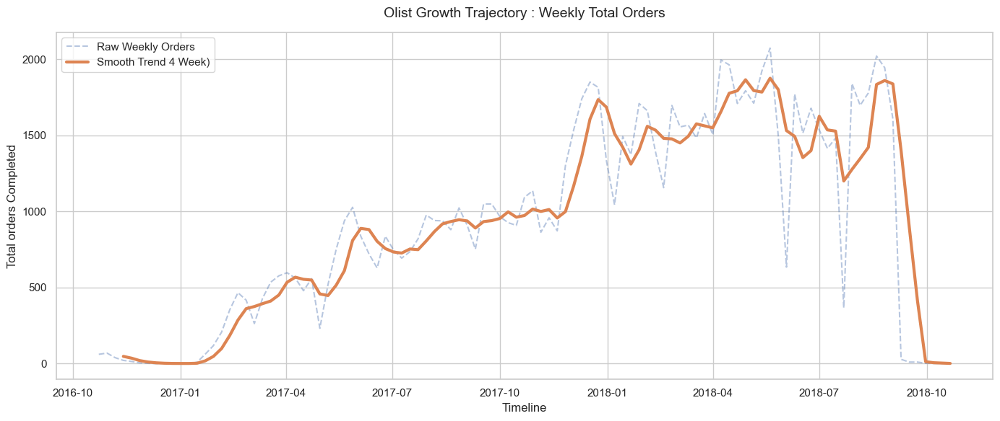
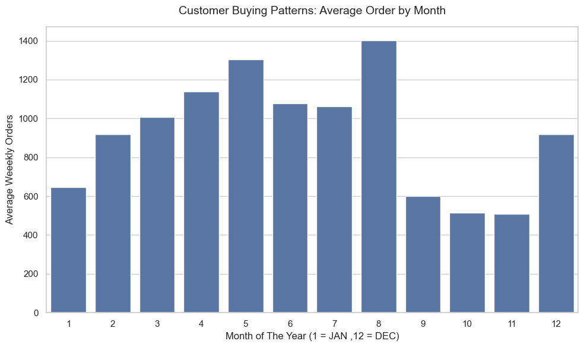

# Olist E-Commerce: Time-Series Data Engineering & EDA

## Overview
This project focuses on the foundational step of time-series forecasting: **Data Engineering and Feature Extraction**. Using the massive [Olist Brazilian E-Commerce Dataset](https://www.kaggle.com/datasets/olistbr/brazilian-ecommerce), this notebook transforms over 100,000 raw, disparate transaction logs into a clean, feature-rich timeline ready for machine learning algorithms.

While many beginner projects rely on pre-packaged datasets with explicit target variables (like the Titanic dataset), this project tackles the reality of industry data science: **defining the business problem and engineering the target variable from scratch.**

## The Challenge
* **No explicit "Sales" column:** The target variable (`total_orders` per week) had to be engineered by setting a Datetime backbone and resampling granular transaction data.
* **Algorithm Amnesia:** Machine learning models process data one row at a time. To enable future forecasting (e.g., using XGBoost), the data required complex feature engineering to give the algorithm a "memory" of past momentum.

## Key Techniques & Pipeline
1. **Temporal Structuring:** Converted `order_purchase_timestamp` strings into Python Datetime objects and established time as the DataFrame index.
2. **Resampling:** Downsampled 100k+ high-frequency transactional rows into distinct 1-week buckets.
3. **Feature Engineering (Memory):** Created `Lag_1` and `Lag_2` features using Pandas `.shift()` to capture week-over-week sales momentum.
4. **Feature Engineering (Seasonality):** Extracted `month` variables and engineered a binary `is_holiday_season` flag to explicitly teach models about Q4 Black Friday/Christmas spikes.

## Visual Insights (EDA)
The Exploratory Data Analysis visually validates the engineered features and uncovers clear business trends:
* **The Macro Trend:** A 4-week moving average overlaid on the raw sales data proves a steady, upward growth trajectory for the company between 2017 and 2018.
* **The Seasonality:** Grouping the resampled data by month definitively highlights November as the peak revenue driver, validating the inclusion of the holiday feature flag.
## Visual Insights (EDA)
The Exploratory Data Analysis visually validates the engineered features and uncovers clear business trends.

### 1. The Macro Trend
A 4-week moving average overlaid on the raw sales data proves a steady, upward growth trajectory for the company between 2017 and 2018.

### 2. The Seasonality
Grouping the resampled data by month definitively highlights November as the peak revenue driver, validating the inclusion of the holiday feature flag.

## Tech Stack
* **Data Manipulation:** `pandas`, `numpy`
* **Visualization:** `matplotlib`, `seaborn`

## How to Run
1. Clone the repository.
2. Download the `olist_orders_dataset.csv` from Kaggle and place it in the root directory.
3. Run the Jupyter Notebook to view the complete data transformation pipeline and visual EDA.